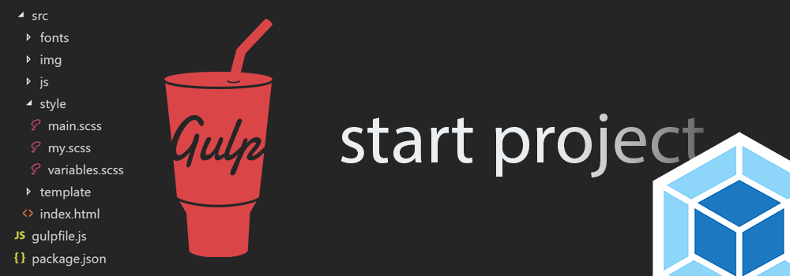

<h1>Gulp start: (SCSS + TailwindCSS) and Webpack start: (SCSS)</h1>

<h3>About</h3>

This is a custom build of the Gulp task manager that speeds up the website development process.

<ul>
<li>Author: Andriy Ovcharov;</li>
<li>Recommended version Node.Js: 22.13.1 (LTS) (https://nodejs.org/dist/v22.13.1/node-v22.13.1-x64.msi)</li>
<li>E-mail: ovcharovcoder@gmail.com</li>
</ul>

<h3> Assembly capabilities </h3>

<ol>
<li>Compresses and converts style files from format .scss to format .min.css;</li>
<li>Compresses JS script files;</li>
<li>The site is built in real time on the fly;</li>
<li>Adding vendor prefixes to the styles file;</li>
<li>Converts images from .jpg, .png to .webp;</li>
<li>The final build is performed with the previous cleanup of obsolete files.</li>
</ol>

<h3> Instructions for using the tool </h3> 
<ol>
<li>To start working with the website assembly tool, you need to copy all the files into an empty folder of the new project : 
<code>npm i</code> </li>

<li>After this, to start developing the website, you need to enter the command in the terminal:
<code>gulp</code> </li>

<li>After completing development and to perform operations to compress and convert project files, you must enter the final command:
<code>gulp building</code> </li>

<li>To stop the build process, press the key combination: 'Ctrl+C'. </li>

<li>Individual components of HTML pages must be saved in the folder "components", and the main part of the code for HTML must be written in the index.html file in the folder "pages". Other HTML project files must also be saved in the "pages" folder. The finished version of the HTML layout file will be saved in the root "app" folder. </li>
</ol>

