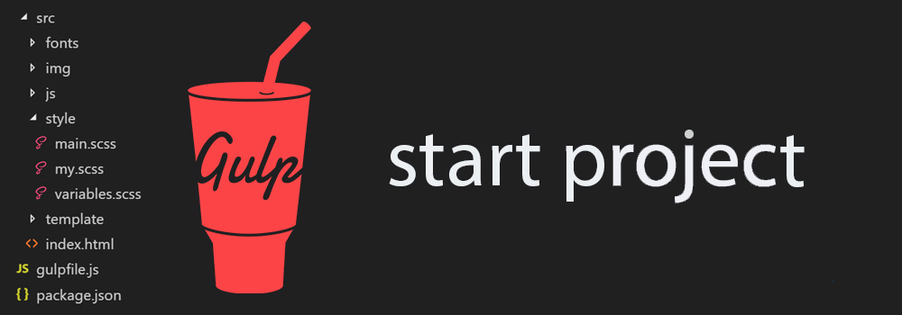

<h1>Gulp start</h1>
											  
ПРО ЗБІРКУ
--------------------------------------------------
- Автор: Андрій Овчаров;
- Дата збірки: 09.04.2026;
- Збірка "Gulp-start" є допоміжним інструментом для веброзробника, що дозволяє виконувати розробку вебсайтів за макетами Figma швидше та зручніше, адже має перелік відповідних плагінів та передбачає модульну будову проєкту.

**Збірка підтримує:** 
- Gulp: CLI version: 3.0.0
- npm: 11.1.0
- Node JS: 22.14.0 (LTS)

ЗБІРКА ДОЗВОЛЯЄ:
-------------------------------------------------
- Конвертувати .scss у .css з підтримкою автопрефіксів;
- Мініфікувати (стискати) файли .css, .js та файли зображень;
- Виконувати розробку вебсайту в live-режимі з автоматичним оновленням сторінок та без кешування завдяки BrowserSync;
- Конвертувати файли зображень .png та .jpg у формат .webp та .avif;
- Оптимізувати зображення .svg та виконувати очищення кешу зображень;
- Конвертувати шрифти з .ttf та .otf у .woff та .woff2;
- Перевіряти .scss файли на помилки та відповідність стандартам за допомогою CSS Lint;
- Підтримує модульну будову, розробку вебсайту з окремих компонентів;
- Показувати повідомлення про помилки під час компіляції стилів та скриптів.

ПІДГОТОВКА ТА РОБОТА ЗІ ЗБІРКОЮ:
----------------------------------------------------
1. Встановити/оновити до останньої версії Node.js: (^22.14.0)
2. Встановити npm пакетний менеджер
3. Команди для встановлення gulp (у разі потреби):  
```npm install --global gulp-cli```</br>
```npm install --save-dev gulp```
4. Розгорнути стартову збірку: ```npm i``` (або ```npm install```)
5. Запустити gulp: ```gulp``` (або ```npm run dev```)
6. Завершити роботу gulp: Ctrl+C
7. Зібрати остаточний проєкт в папку /dist: ```gulp build``` (або ```npm run build```)


ПЕРЕВІРКА РОБОЧОГО СТАНУ ЗБІРКИ:
----------------------------------------------------
Після розпаковки вмісту архіву у теку з проєктом необхідно розгорнути Збірку (команда: ```npm i```) та запустити Gulp (команда: ```gulp```).
Якщо у вікні браузера відобразиться текст привітання, то збірка працює коректно.

СТРУКТУРА ЗБІРКИ:
---------------------------------------------------
```
app/
|-- components/
|   |-- header.html
|   |-- aside.html
|   |-- footer.html
|
|-- fonts/
|   |-- src/
|   
|-- images/
|   |-- icons/
|   |-- src/
|
|-- js/
|   |-- libs/
|   |   |--anim.js 
|   |   |--dd-menu.js 
|   |-- main.js 
|   |-- scripts.js 
|   
|-- pages/
|   |-- index.html
|
|-- scss/
    |--_fonts.scss
    |--_footer.scss
    |--_global.scss
    |--_main.scss
    |--_media.scss
    |--_mixins.scss
    |--_modal.scss
    |--_swiper.scss
    |--_vars.scss
    |--_optimize.scss
    |--style.scss

.gitignore
gulpfile.js 
package.json
postcss.config.js
readme.txt
```


РОБОТА З ФАЙЛАМИ ПРОЄКТА
---------------------------------------------------

Робота із зображеннями:
Всі вихідні зображення потрібно зберігати у теці app/img/src. Зображення будуть конвертовані у формат .webp та avif.
Зображення іконок svg не ковертуються, а лише стискаються. Такі зображення необхідно зберігати в окремій теці: app/img/icons. 
Після обробки, зображення іконок буде автоматично додано до теки: app/img/icons.


Робота зі шрифтами:
---------------------------------------------------
Всі вихідні шрифти у форматі .ttf та .otf необхідно зберігати у теці: app/fonts/src. Всі вони будуть конвертовані у формати: .woff та .woff2 та переміщені до теки: app/fonts. 
Для успішної конвертації шрифтів, бажано зупинити Gulp, додати шрифти до папки та повторно запустити Gulp. Конвертація шрифтів може зайняти деякий час.


Робота зі стилями css:
---------------------------------------------------
Переважна більшість вихідних стилів необхідно прописувати у файлі _main.scss за адресою app/scss, а стилі сторонніх плагінів.
Окремі стилі-компоненти, рекомендується підключати через @use.

При цьому структура таких компонентів має наступний вигляд:

- @use 'vars';  // Вказуються стилі змінних
- @use 'mixins'; // Вказуються міксини
- @use 'optimize';  // reset css
- @use 'anim'; // Вказуються стилі для анімації
- @use 'fonts'; // Вказуються стилі для шрифтів
- @use 'global';  // Вказуються глобальні стилі
- @use 'libs';  // Вказуються стилі до плагінів
- @use 'main'; // Вказуються всі стилі окрім глобальних
- @use 'media';   // Вказуються стилі для адаптиву

  **Важливо** Якщо @use викликає помилку, використовуй @import.


 📌 Що містить файл global.css?

- Нормалізація стилів (reset або normalize.css).
- Базові стилі для HTML-елементів (body, h1-h6, p, a, ul, ol, button, input, .container, .btn
тощо).


Робота зі скриптами javascript:
----------------------------------------------------
Усі вихідні скрипти бажано прописувати у відповідні файли за адресою app/js. Скрипти плагінів, встановлені через npm, необхідно прописувати gulpfile.js.


Робота зі сторінками html:
----------------------------------------------------
Всі сторінки html слід зберігати за адресою: app/pages, а окремі їх компоненти (header.html, sidebar.html, footer.html та ін.) рекомендується зберігати за адресою: app/components і під'єднувати до html-сторінок, через @@include.

Наприклад: 

@@include('header.html') - під'єднуємо header.html

... код сторінки ...

@@include('footer.html') - під'єднуємо footer.html

## ☕ Сподобалась збірка? 
Пригостіть автора кавою через [PayPal](https://www.paypal.com/donate/?business=datoshcode@gmail.com)


**Приємної роботи!**



 ## Ліцензія

<a href="LICENSE">MIT LICENSE</a>


